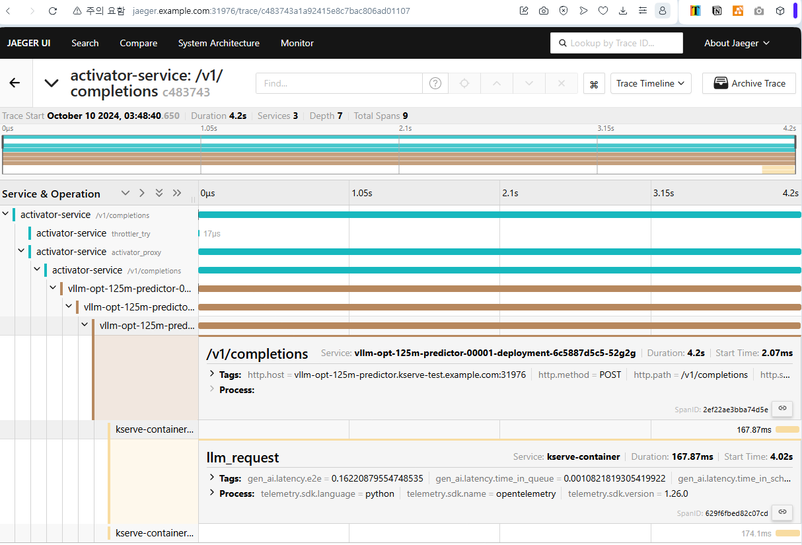

## Install KServe
- [kserve quickstart](https://kserve.github.io/website/latest/get_started/#install-the-kserve-quickstart-environment)
- Skip `kind` install

```bash
curl -s "https://raw.githubusercontent.com/kserve/kserve/release-0.13/hack/quick_install.sh" | bash
# if above installation fails, then try again
helm install kserve-crd oci://ghcr.io/kserve/charts/kserve-crd --version v0.13.0
helm install kserve oci://ghcr.io/kserve/charts/kserve --version v0.13.0
```

## Test InferenceService
- [First Inference](https://kserve.github.io/website/latest/get_started/first_isvc/)

```bash
kubectl create namespace kserve-test
kubectl -n kserve-test apply -f sklearn-iris.yaml
```

### (Optional) Swagger UI

```bash
kubectl edit svc istio-ingressgateway -n istio-system
# LoadBalancer -> NodePort
```
- Check 80:PORT
- Edit hosts file 
- http://sklearn-iris.kserve-test.example.com:{PORT}/docs#

## (Knative) Trace Config
```bash
kubectl patch --namespace knative-serving configmap/config-tracing \
--type merge \
--patch '{"data":{"backend":"zipkin","zipkin-endpoint":"http://jaeger.observability:9411/api/v2/spans", "debug": "true"}}'
```

## kserve-cotainer (VLLM)
### Build VLLM Docker Image 
- Add opentelemetry libraries, which are needed to enable otlp option
```bash
docker build -t dev.local/vllm-otel:v0.6.2 ./vllm
```

### Run VLLM
```bash
kubectl -n kserve-test apply -f vllm-otel.yaml
```

### Test
```bash
curl -X 'POST' \
  'http://vllm-opt-125m-predictor.kserve-test.example.com:31976/v1/completions' \
  -H 'accept: application/json' \
  -H 'Content-Type: application/json' \
  -d '{
        "model": "facebook/opt-125m",
        "prompt": "San Francisco is a",
        "max_tokens": 7,
        "temperature": 0
    }'
```


- ⚠️ NOT all apis are traced. 
  - `/v1/models` is not traced
  - `/v1/completions` is traced.


## Debug Log
- This Section is for record only

<details>

## Debug `kserve-container`
```bash
# Attach Debug Container
kubectl debug -it pod/sklearn-iris-predictor-00002-deployment-7cdb7955f8-s244d --image=nicolaka/netshoot --target kserve-container -- /bin/bash

# (Inside Debug Container) Watch HTTP
ngrep -W byline -d any port 8080

# (Outside) Send HTTP Request
curl -v -H "Content-Type: application/json" http://sklearn-iris.kserve-test.example.com:31976/v1/models/sklearn-iris:predict -d @./iris-input.json
```

### Result
- activator-service --> queue proxy --(?)-> Kserve Container
- Trace to `queue proxy`
  
- Inside Kserve Container
  ```bash
  jh@DESKTOP-F1CKV6N:~/test$ kubectl debug -it pod/sklearn-iris-predictor-00002-deployment-5b85d4ffd5-c87h4 --image=nicolaka/netshoot --target kse
  rve-container -- /bin/bash
  
  sklearn-iris-predictor-00002-deployment-5b85d4ffd5-c87h4:~# ngrep -W byline -d any port 8080
  interface: any
  filter: ( port 8080 ) and (ip || ip6)
  ##########
  T 127.0.0.1:55450 -> 127.0.0.1:8080 [AP] #10
  GET /v1/models HTTP/1.1.
  Host: sklearn-iris-predictor.kserve-test.svc.cluster.local.
  User-Agent: Mozilla/5.0 (Windows NT 10.0; Win64; x64) AppleWebKit/537.36 (KHTML, like Gecko) Chrome/127.0.0.0 Safari/537.36 OPR/113.0.0.0.
  Accept: application/json.
  Accept-Encoding: gzip, deflate.
  Accept-Language: ko-KR,ko;q=0.9,en-US;q=0.8,en;q=0.7.
  Forwarded: for=192.168.65.3;proto=http, for=10.1.0.19, for=10.1.0.19.
  K-Proxy-Request: activator.
  Referer: http://sklearn-iris.kserve-test.example.com:31976/docs.
  Traceparent: 00-66f29b10a58aa99e7504687f3b5bcf84-ffd8e422dca89bfe-01.
  X-B3-Parentspanid: 7504687f3b5bcf84.
  X-B3-Sampled: 1.
  X-B3-Spanid: ffd8e422dca89bfe.
  X-B3-Traceid: 66f29b10a58aa99e7504687f3b5bcf84.
  X-Envoy-Attempt-Count: 1.
  X-Envoy-Decorator-Operation: sklearn-iris-predictor-00002.kserve-test.svc.cluster.local:80/*.
  X-Envoy-External-Address: 10.1.0.19.
  X-Envoy-Peer-Metadata: ChoKCkNMVVNURVJfSUQSDBoKS3ViZXJuZXRlcwobCgxJTlNUQU5DRV9JUFMSCxoJMTAuMS4wLjE5ChkKDUlTVElPX1ZFUlNJT04SCBoGMS4yMC40CpwDCgZMQUJFTFMSkQMqjgMKHQoDYXBwEhYaFGlzdGlvLWluZ3Jlc3NnYXRld2F5ChMKBWNoYXJ0EgoaCGdhdGV3YXlzChQKCGhlcml0YWdlEggaBlRpbGxlcgo2CilpbnN0YWxsLm9wZXJhdG9yLmlzdGlvLmlvL293bmluZy1yZXNvdXJjZRIJGgd1bmtub3duChkKBWlzdGlvEhAaDmluZ3Jlc3NnYXRld2F5ChkKDGlzdGlvLmlvL3JldhIJGgdkZWZhdWx0CjAKG29wZXJhdG9yLmlzdGlvLmlvL2NvbXBvbmVudBIRGg9JbmdyZXNzR2F0ZXdheXMKEgoHcmVsZWFzZRIHGgVpc3Rpbwo5Ch9zZXJ2aWNlLmlzdGlvLmlvL2Nhbm9uaWNhbC1uYW1lEhYaFGlzdGlvLWluZ3Jlc3NnYXRld2F5Ci8KI3NlcnZpY2UuaXN0aW8uaW8vY2Fub25pY2FsLXJldmlzaW9uEggaBmxhdGVzdAoiChdzaWRlY2FyLmlzdGlvLmlvL2luamVjdBIHGgVmYWxzZQoaCgdNRVNIX0lEEg8aDWNsdXN0ZXIubG9jYWwKLwoETkFNRRInGiVpc3Rpby1pbmdyZXNzZ2F0ZXdheS03ZGI1ZDc0ODg3LTlmNDd2ChsKCU5BTUVTUEFDRRIOGgxpc3Rpby1zeXN0ZW0KXQoFT1dORVISVBpSa3ViZXJuZXRlczovL2FwaXMvYXBwcy92MS9uYW1lc3BhY2VzL2lzdGlvLXN5c3RlbS9kZXBsb3ltZW50cy9pc3Rpby1pbmdyZXNzZ2F0ZXdheQonCg1XT1JLTE9BRF9OQU1FEhYaFGlzdGlvLWluZ3Jlc3NnYXRld2F5.
  X-Envoy-Peer-Metadata-Id: router~10.1.0.19~istio-ingressgateway-7db5d74887-9f47v.istio-system~istio-system.svc.cluster.local.
  X-Forwarded-For: 192.168.65.3,10.1.0.19, 10.1.0.19, 10.1.0.21.
  X-Forwarded-Proto: http.
  X-Request-Id: 3f1110ef-1e4b-4635-9591-862329144b24.
  .
  
  ```
</details>

## Reference
### VLLM
- [VLLM OpenTelemetry](https://github.com/vllm-project/vllm/blob/main/examples/production_monitoring/Otel.md)
- [VLLM on Pascal GPU](https://github.com/sasha0552/pascal-pkgs-ci)
  - Unoffcial support for Pascal GPU
  - Very Cool Project, Huge thanks to sasha0552
- [Kserve & VLLM](https://kserve.github.io/website/latest/modelserving/v1beta1/llm/vllm/#deploy-the-llama-model-with-vllm-runtime)

### Kserve
- [Kserve quickstart](https://kserve.github.io/website/latest/get_started/)
- [KNative OpenTelemetry](https://knative.dev/blog/articles/distributed-tracing/)
  - KNative Setting automatically applied to Kserver because Kserve uses KNative
  - Even though KNavtive uses opencensus(zipkin), 'traceparent' HTTP Header should propagate trace context to opentelemetry library.
- [How to store model weight in PV](https://github.com/kserve/modelmesh-serving/blob/main/docs/predictors/setup-storage.md#deploy-a-model-stored-on-a-persistent-volume-claim)

### Trace
- [W3C Trace Context](https://www.w3.org/TR/trace-context/)

### CUDA & Kubernetest & Docker Desktop & WSL
- [Cuda on WSL](https://docs.nvidia.com/cuda/wsl-user-guide/index.html)
- [Nvidia Container Toolkit](https://docs.nvidia.com/datacenter/cloud-native/container-toolkit/latest/install-guide.html#installing-the-nvidia-container-toolkit)
- [Nvidia/k8s-device-plugin](https://github.com/NVIDIA/k8s-device-plugin)
- [Docker Desktop - Nvidia Container Toolkit setting](https://stackoverflow.com/a/77343231/10722255)
